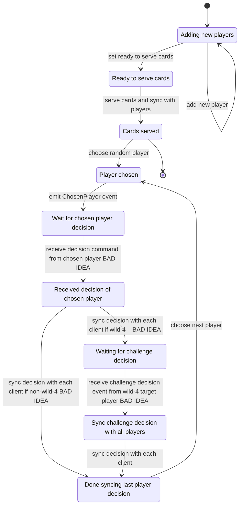
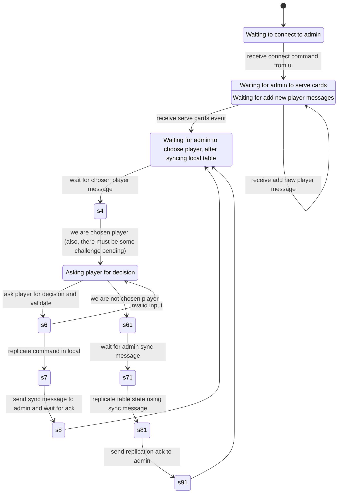
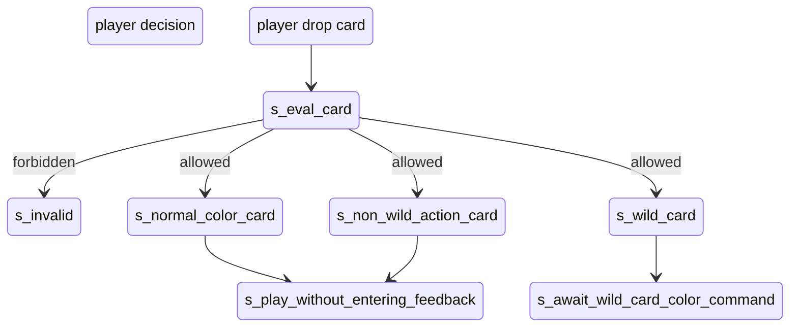

# Uknow design

Have a server idiot. Replicate THAT. Not the fucking clients. Idiot.

Server has all the game logic. Just asks player to execute a command. 

Console - which is the "client" just executes commands based on what the gameserver decides. The gameserver will sometimes ask for player input to the console.

## Client and server timeouts and keep_alive connections

The reason most http servers in the wild, have a MaxIdleConnsPerHost > 0, is because they are
calling some upstream service while servicing one or more incoming requests in parallel. This means
if there 5 idle keep-alive conns present in the free list, we can use these to make 5 requests at
most. If the situation arises where to make more than 5 requests in parallel, new conns, i.e.
sockets have to be created to the host. Suppose that we have created 2 extra conns, so in total 7
conns are in use. After all of them return, only 5 will be kept (maybe in an MRU fashion) in the
free list and the rest will be closed and returned to the OS.

But in a synchronous app like uknow, you would usually and by that I mean 99% of the time, not make
multiple parallel requests to the same host. So it doesn't make sense to keep a large pool of idle
conns for any of the hosts.

Client organism

Maintains state regarding - whether it can respond or not.

Yes some commands can be approved by the client itself. Should we think about this on a command by command basis? What about a challenge?

That puts the admin in an executing-commands state. Every game-command is a state modifier. So it makes sense to route these through the admin.

## State machine

Starting from the state that all members have collected.

Server state machine

Client state machine

Starting approach

- PlayerClient handles POST /event.
- Creates a UI command based on the event and sends the command to ClientUI on a channel.

The `Cards served` and `Player chosen` states are simply here to help debug. Since we already synced the cards as we reached the `Cards served` state, every player knows the chosen player.

When the PlayerClient asks the user for decision, all eligible commands are logged as they are occuring in local. The commands are sent to admin and replayed. Same for all other players. The other players will know the next players turn in this way.

1. Send UICommandAskUserForDecision to ClientUI on the askUserForDecisionChan.
2. TODO(@rk): Compute the set of eligible repl commands that the user can make first.
3. When the user inputs a repl command, *the table object will be used to run a goro that executes the command as well as send command transfer events on a channel that the clientUI will send to it.*

UI should have cards shown as colored. The Discard Pile and the Player Hand in particular could be grids themselves.

Card play state - specific to uknow.Table only.

Here `s_enter_wild_card_feedback` denotes a state where the table is expecting a `wild_color <color>` command from the player.

What about `wild_draw_4`?

## Win condition

A player has no cards left. Can only happen after a player has dropped a card.
